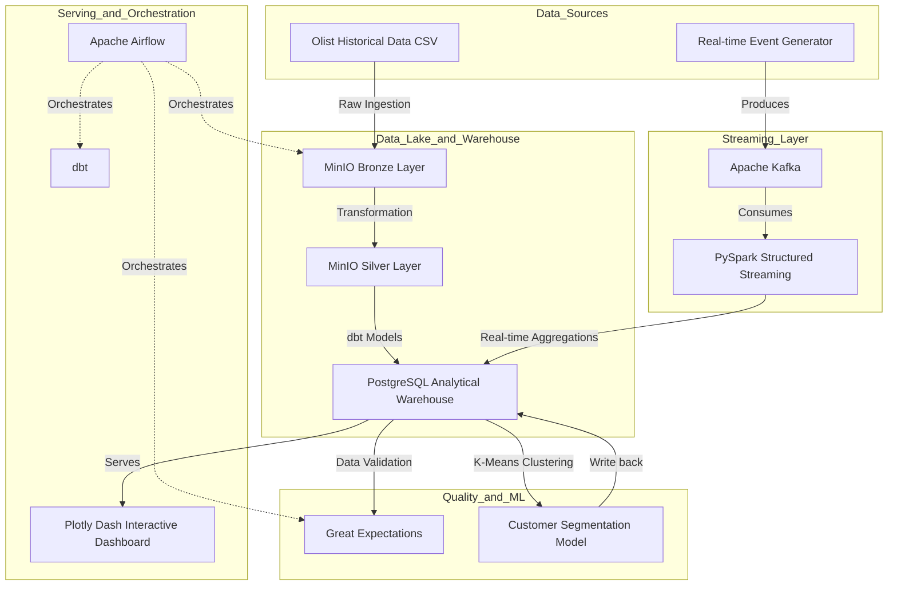

# E-commerce Data Platform 🚀

An end-to-end Data Engineering portfolio project demonstrating a modern, hybrid **batch and real-time streaming data platform** using the Brazilian E-Commerce Public Dataset (Olist).

This project integrates industry-standard tools to build a robust data pipeline, transforming raw e-commerce data into business-ready analytical assets, complete with data quality validation, machine learning clustering, and an interactive real-time dashboard.

---

## 🌟 Key Features

- **Hybrid Processing**: Combines batch historical data ingestion with real-time streaming event processing.
- **Modern Data Stack**: Utilizes **dbt** for idempotent data transformations and **Great Expectations** for rigorous data quality checks.
- **Medallion Architecture**: Adopts the Bronze (Raw), Silver (Cleaned), and Gold (Analytical) data lakehouse design pattern.
- **Machine Learning Integration**: Features RFM (Recency, Frequency, Monetary) customer segmentation using Scikit-Learn, surfaced directly on the dashboard.
- **High-Performance Dashboard**: A highly interactive Plotly Dash application featuring 15+ concurrent charts optimized with PostgreSQL B-Tree indexing and `ThreadPoolExecutor`.
- **Infrastructure as Code**: Entirely containerized and reproducible with `docker-compose`.

---

## 🏗 Architecture



---

## 🛠 Technology Stack

| Component | Technology |
|---|---|
| **Data Orchestration** | Apache Airflow |
| **Data Transformation** | dbt (Data Build Tool), PySpark |
| **Data Quality** | Great Expectations |
| **Event Streaming** | Apache Kafka, Zookeeper |
| **Data Lake** | MinIO (S3 Compatible) |
| **Data Warehouse** | PostgreSQL 16 |
| **Machine Learning** | Scikit-Learn (K-Means Clustering), Pandas |
| **Visualization** | Plotly Dash |
| **Containerization** | Docker, Docker Compose |
| **Testing & CI** | Pytest, GitHub Actions |

---

## 📊 The Dashboard

The analytical dashboard serves as the front-end for business users to interact with the Gold layer data. It features:
- **Sales & Revenue**: Revenue over time, category breakdowns, and payment methods.
- **Orders & Operations**: Delivery time distributions, late delivery tracking, and order heatmaps.
- **Customer Insights**: Retention rates, demographic maps, and new customer acquisition trends.
- **ML Customer Segments**: 3D scatter plots and Radar charts showcasing the RFM model results, classifying customers into groups like *Champions*, *At Risk*, and *Loyal Customers*.

*(Note: Add screenshots of the dashboard here)*

---

## 🚀 Quick Start

### 1. Prerequisites
- Docker & Docker Compose
- Python 3.11+ (for local development/testing)
- At least 8 GB RAM

### 2. Clone the Repository
```bash
git clone https://github.com/hquan07/ecommerce-data-platform.git
cd ecommerce-data-platform
```

### 3. Environment Setup
```bash
cp .env.example .env
# Edit .env with your desired credentials if necessary
```

### 4. Start the Infrastructure
```bash
# Build and start all services
docker-compose up -d --build
```
This command spins up PostgreSQL, Airflow, MinIO, Kafka, Spark, and the Plotly Dashboard.

### 5. Access the Services
Once all containers are healthy, you can access the UIs at:
- **Dashboard**: `http://localhost:8050`
- **Airflow**: `http://localhost:8080` (Trigger the `ecommerce_batch_pipeline` DAG to populate data)
- **MinIO Console**: `http://localhost:9001`

---

## ⚙️ Data Engineering Design Decisions

1. **Why dbt over pure Spark for transformations?** 
   While Spark handles the heavy lifting of raw data processing (Bronze to Silver), dbt is utilized for Silver to Gold transformations. dbt provides excellent data lineage, documentation, and makes the dimensional modeling (Star Schema) declarative and version-controlled.
   
2. **Why Great Expectations?**
   Data quality is paramount. GX is integrated directly into the Airflow DAG to halt the pipeline if anomaly data (e.g., negative order values or null constraints) breaches the threshold, preventing downstream dashboard corruption.

3. **Performance Optimizations**
   - **PostgreSQL Indexing**: Strategic B-Tree indexes on `order_purchase_timestamp`, `customer_id`, and `order_status` reduce query latency from tens of seconds to milliseconds.
   - **Shared Memory Limit**: PostgreSQL `shm_size` is optimized to `256m` in Docker to support parallel analytical aggregations.
   - **Concurrent UI Fetching**: The Plotly Dash backend utilizes Python's `ThreadPoolExecutor` to fetch over 15 analytical queries concurrently without blocking the UI thread.

---

## 📝 License
This project is open-source and intended as a Data Engineering portfolio showcase. The Olist dataset is publicly available on Kaggle under its respective licensing.
